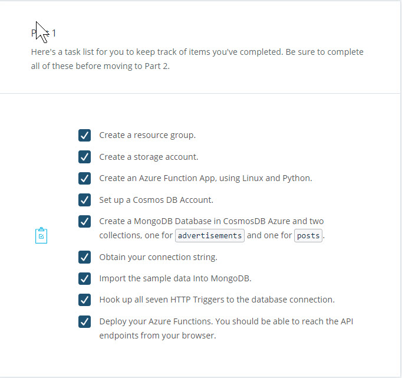
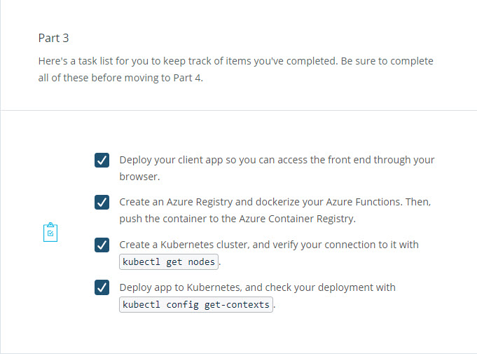
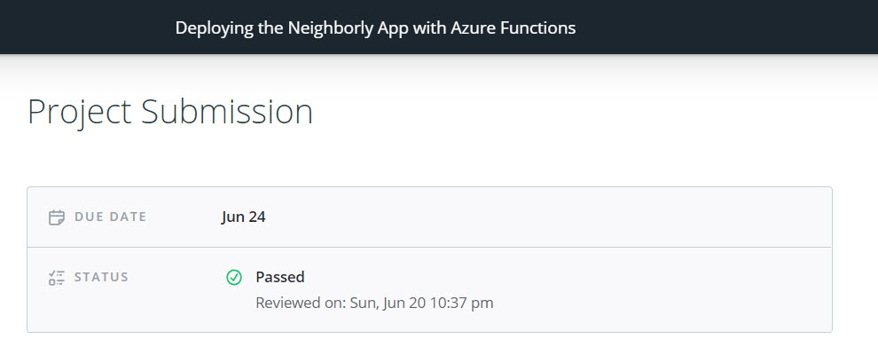
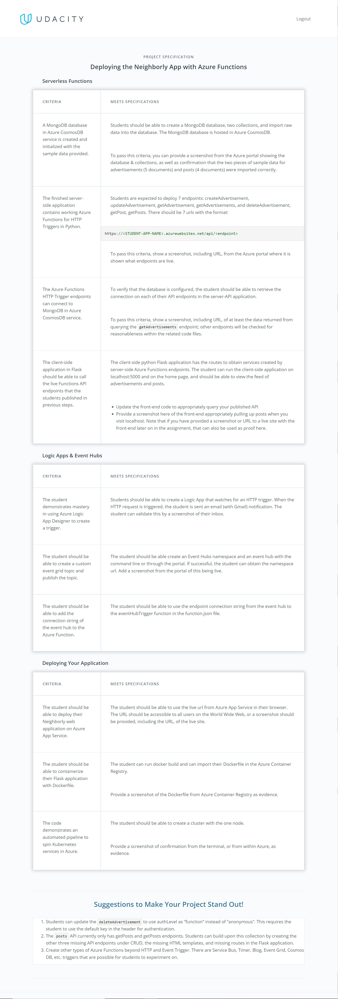

# Neighborly App with Azure Functions

Description here

## Summary

This project has the following parts:

- Creating an Azure Function App

- Deploying the Client-Side Flask Web Application

- CI/CD Deployment

- Event Hubs and Logic App

## Demo Videos

- This is a short demo of how to create and utilize a deployment yaml file for an Azure function app to an existing Kubernetes service. Also, we show another option of deploying directly to Kubernetes from a Docker container residing on the Azure Container Registry. Lastly, we tour through our deployment running on a Kubernetes service with the Azure portal.

## Udacity 

[Udacity Project Step-By-Step Instructions](DeployingtheNeighborlyAppwithAzureFunctions.md)

[Starter Code Repository](https://github.com/udacity/nd081-c2-Building-and-deploying-cloud-native-applications-from-scratch-project-starter)
## Grading Rubric

