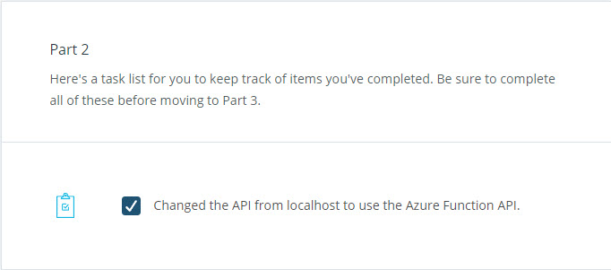

# Neighborly App with Azure Functions

This project has the following parts:

- Creating an Azure Function App

- Deploying the Client-Side Flask Web Application

- CI/CD Deployment

- Event Hubs and Logic App

## Udacity 

[Udacity Project Step-By-Step Instructions](DeployingtheNeighborlyAppwithAzureFunctions.md)

[Starter Code Repository](https://github.com/udacity/nd081-c2-Building-and-deploying-cloud-native-applications-from-scratch-project-starterd)

## Grading Rubric

